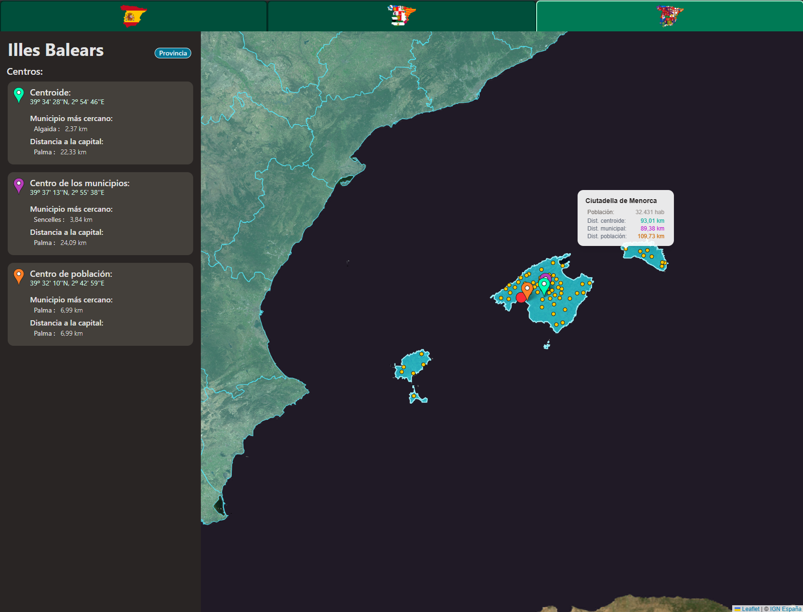
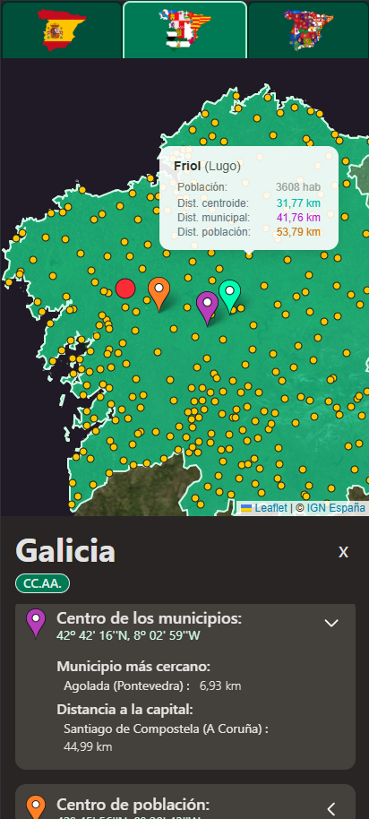

# Provinces-web

A web app built with Vue 3 and Tailwind that allows users to see the center of the different regions of Spain (country-level, autonomy-level and province-level), and navigate them interactively, using data from the IGN ([Instituto Geográfico Nacional](https://ign.es))

Check out the project here https://dangarcar.github.io/provinces-web/



## Functionality

You can see 3 types of centers and the distances from every village to each center.
There are three types of centers in this app:

### - Centroid


The centroid is the center of the polygon of the region, calculated in the browser with the GeoJSON data from the IGN if the `?calculate` option is set

### - Municipal


This is the mean of all positions of the different municipalities within the selected region

### - Population


This is the weighted average of positions taking the population of each municipality, taken from INE ([Instituto Nacional de Estadística](https://ine.es)), within the selected region


## Features
In most cases you don't want the calculations to be done on your machine, as it can be pretty slow.

However, if you want all the calculations to be done on your machine, browse with this url: https://dangarcar.github.io/provinces-web/?calculate, and you would get the data from the IGN and INE instead of my servers, taking at least several seconds.


## Mobile
The web app works the same on desktop and mobile, having being designed responsively



## Installation

Clone the repository:

```bash
git clone https://github.com/dangarcar/provinces-web.git
cd provinces-web
```

Install dependencies:

```bash
npm install
```

Run the development server:

```bash
npm run dev
```

Build for production:

```bash
npm run build
```
